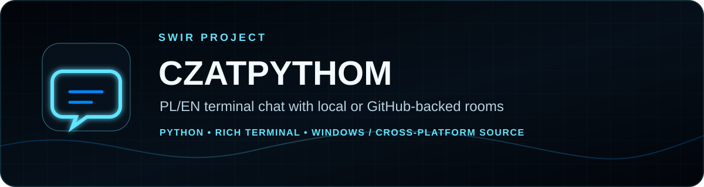
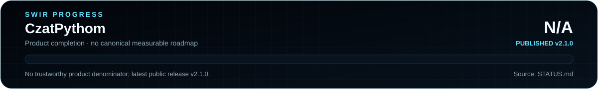

<!-- SWIR-README-STANDARD:v2 -->

<div align="center">



<br>


[](https://github.com/Swir)
[](https://github.com/Swir/czatpythom/stargazers)

<br>

[**Highlights**](#-highlights) · [**Quick Start**](#-quick-start) · [**Shared Rooms**](#-shared-github-rooms) · [**Status**](STATUS.md) · [**Releases**](#-releases)

</div>


## 📍 Project Status



| Item | Status |
|---|---|
| Current state | Published utility — v2.1.0 |
| Runtime | Python 3.10+; CI covers Python 3.10–3.14 |
| UI | Rich terminal |
| Storage | Local JSON by default; optional GitHub repository backend |
| Latest public release | [v2.1.0](https://github.com/Swir/czatpythom/releases/tag/v2.1.0) |
| Product completion | **N/A** — no canonical measurable roadmap/denominator exists |
| Detailed status | [STATUS.md](STATUS.md) |

The release version, test count, commit count and documentation completeness are not treated as a product-completion percentage.

## 🚀 Overview

**CzatPythom** is a multilingual PL/EN terminal chat client built in Python. It combines a zero-setup local JSON backend with an optional GitHub-repository backend for small shared rooms, while keeping configuration and credentials outside the source tree.

Version 2.1.0 restored useful classic-client behavior—nickname/color setup, legacy color migration, confirmed room-history clearing and plain `quit` support—without abandoning the modern modular architecture.

## ✨ Highlights

| Feature | What it does |
|---|---|
| 💬 Local rooms | Starts without an external service by storing room data locally |
| ☁️ Optional GitHub backend | Stores room JSON in a repository selected by the user |
| 🌍 PL / EN | Detects system language and keeps one multilingual codebase |
| 🎨 Nick/message colors | Separate nickname and message colors, including migrated legacy Colorama values |
| 🔔 Mentions | Highlights mentions and can emit a terminal bell |
| 🧹 Safe `/clean` | Clears only the active room after explicit confirmation |
| 🔄 Live polling | Background refresh with bounded 2–60 second intervals |
| 🛡️ Token handling | Reads the GitHub token from the environment and does not persist it in `config.json` |
| 📦 Windows packaging | Public v2.1.0 provides EXE, portable ZIP and SHA256 files |

## ⚙️ Quick Start

### Recommended — Windows release

Download the current **v2.1.0** assets from [GitHub Releases](https://github.com/Swir/czatpythom/releases/tag/v2.1.0). The release workflow publishes a standalone EXE, a portable Windows ZIP and SHA256 checksum files.

### From source

```bash
git clone https://github.com/Swir/czatpythom.git
cd czatpythom
python -m pip install -e .
python -m czatpythom
```

On the first interactive run, choose a nickname and separate nickname/message colors. Press Enter at the nickname prompt to keep the generated guest identity.

## 📋 Requirements / Compatibility

- Python **3.10+** from source; repository CI covers 3.10, 3.11, 3.12, 3.13 and 3.14.
- `requests` and `rich` are runtime dependencies declared by `pyproject.toml`.
- The packaged EXE is intended for Windows.
- GitHub-backed rooms require a repository you control and a fine-grained token with only the required repository access.

## ☁️ Shared GitHub Rooms

GitHub mode stores each room as a JSON file in a repository you choose. For non-public conversation history, use a **private repository**.

```powershell
$env:CZATPYTHOM_BACKEND = "github"
$env:CZATPYTHOM_REPOSITORY = "OWNER/private-chat-data"
$env:CZATPYTHOM_GITHUB_TOKEN = "github_pat_..."
CzatPythom.exe --room lobby
```

Use a fine-grained token restricted to the selected repository. The token is read from the environment only and is never written to `config.json`.

> GitHub-backed chat is intended for a small/private project or demo. GitHub API limits and repository visibility still apply.

## 🎮 Commands

| Command | Action |
|---|---|
| `/help` | Show command help |
| `/room NAME` | Switch rooms |
| `/nick NAME` | Change nickname |
| `/nickcolor COLOR` | Change nickname color |
| `/textcolor COLOR` | Change message color |
| `/colors` | Show supported colors |
| `/status` | Show backend, room, refresh interval and active colors |
| `/clear` | Clear only the local terminal screen |
| `/clean` | Clear the active room history after confirmation |
| `/quit` or `quit` | End the session |

Supported colors: `green`, `blue`, `red`, `yellow`, `magenta`, `cyan`, `bright_green`, `bright_red`, `bright_blue`, `white`.

## 🧠 Technology / Architecture

| Layer | Technology / role |
|---|---|
| UI | Rich terminal application |
| Core | Python package under `src/czatpythom` |
| Local storage | JSON room files |
| Shared storage | GitHub repository API through `requests` |
| Packaging | PyInstaller in the release workflow |
| Tests | Pytest + CLI smoke test across Python 3.10–3.14 |

```text
src/czatpythom/
  app.py          # terminal application and commands
  backends.py     # local + GitHub storage, append/clear operations
  client.py       # polling and client state
  config.py       # per-user configuration
  i18n.py         # PL/EN translations
  models.py       # validated message model + legacy migration
assets/
  app_icon.svg    # source application icon
  app_icon.ico    # generated/packaged Windows icon
tools/
  build_icon.py
  readme_progress.py
tests/
.github/workflows/
```

Runtime data is not committed to the source repository.

## 🧪 Development & Verification

```bash
python -m pip install -e ".[dev]"
python -m pytest
python -m czatpythom --version
python tools/readme_progress.py --check
```

The README progress check verifies the committed SVGs, required embeddings and absence of retired character-based progress meters in maintained status documentation.

## 📦 Releases

Latest verified public release: **[CzatPythom v2.1.0](https://github.com/Swir/czatpythom/releases/tag/v2.1.0)**.

Release artifacts include:

- `CzatPythom.exe`
- `CzatPythom.exe.sha256`
- `CzatPythom-v2.1.0-Windows-x64.zip`
- `CzatPythom-v2.1.0-Windows-x64.zip.sha256`

Historical draft releases may still be visible through GitHub's API, but they are not presented here as current public downloads.

## 🔐 Privacy & Security

- Never commit GitHub tokens.
- Use a private repository for non-public GitHub-backed room history.
- Do not exchange passwords, API keys or recovery codes through repository-backed rooms.
- CzatPythom does not persist the GitHub token.
- `/clean` requires interactive confirmation and only clears the active room.
- New writes and history clears use optimistic retries to reduce repository update conflicts.
- See [`SECURITY.md`](SECURITY.md) for the project's security guidance.

## 🔎 Search Keywords

`python terminal chat` • `rich terminal chat` • `python chat client` • `local json chat` • `github backed chat` • `private repository chat` • `windows terminal chat` • `python windows exe` • `multilingual chat client` • `polish english chat` • `rich python ui` • `github api python` • `terminal room chat` • `portable chat utility` • `czatpythom`


<div align="center">


### `CONNECT • CHAT • CONTROL`

⭐ **If CzatPythom is useful, consider leaving a star.**

[**← SWIR profile**](https://github.com/Swir) · [**All projects →**](https://github.com/Swir?tab=repositories)

</div>
